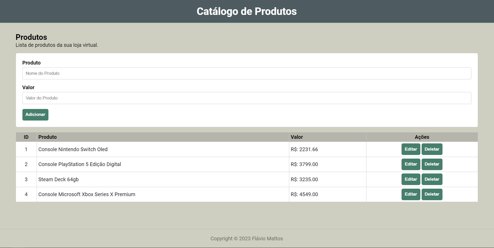
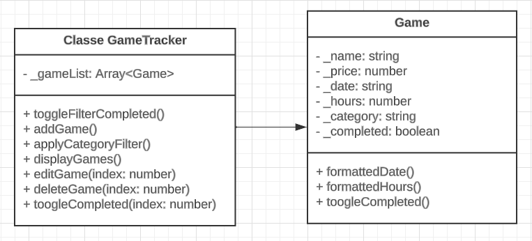

# POO Projeto Individual - Catálogo de produtos

Este repositório GitHub é dedicado a um catálogo de jogos desenvolvido com HTML, CSS e JavaScript, adotando os princípios da programação orientada a objetos. Nosso projeto oferece um conjunto completo de funcionalidades CRUD (Create, Read, Update, Delete), permitindo aos usuários criar, visualizar, atualizar e excluir jogos de forma dinâmica.

## 🚀 Demonstração

[Clique aqui](https://flaviomattosdev.github.io/POO-Projeto-Individual/) para acessar o resultado final do projeto.

## UML Simplificado

## 🛠️ Tecnologias Utilizadas

-  [HTML](https://developer.mozilla.org/pt-BR/docs/Web/HTML) - Linguagem de Marcação
-  [CSS](https://developer.mozilla.org/pt-BR/docs/Web/CSS) - Linguagem de Estilização
-  [Javascript](https://developer.mozilla.org/pt-BR/docs/Web/JavaScript) - Linguagem de Programação

## 👨‍💻 Desenvolvedor

    
    
&nbsp&nbsp&nbspFlávio Mattos 
    &nbsp&nbsp&nbsp<a href="https://www.instagram.com/fflaviomattos/">Instagram</a>&nbsp;|&nbsp;<a href="https://github.com/FlavioMattosDev">GitHub</a>&nbsp;|&nbsp;<a href="https://www.linkedin.com/in/flavio-mattos/">LinkedIn</a>&nbsp;

  

---
